<p align="center">
  
</p>

# HyprSlob Center Bar

A standalone, config-driven **center bar** for [Hyprland](https://hyprland.org/),
built with [Quickshell](https://quickshell.org/). One cohesive pill at the top that
**morphs and expands downward** into a hub of panels - no loose widgets.

<p align="center">
  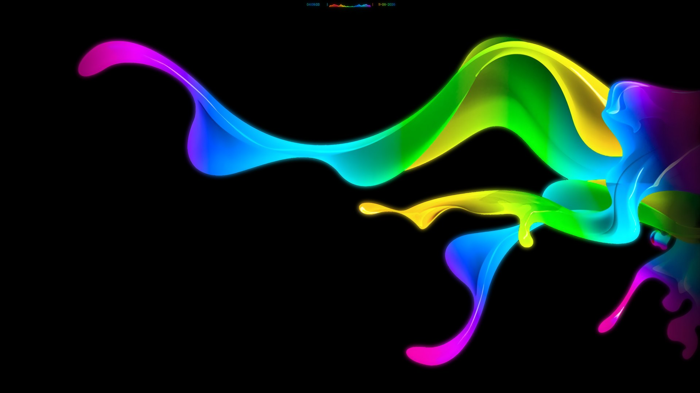
</p>

### Showcase

See it in motion - the morph, the visualizer, the launcher and the panels:

<p align="center">
  <a href="https://www.youtube.com/watch?v=WFAML7jn-bs">
    
  </a>
  <br>
  <sub>▶ Watch on YouTube (~1 min)</sub>
</p>

## The pill

Collapsed, it's intentionally minimal - `Time | Day | Date`:

<p align="center">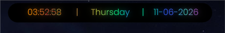</p>

But it does two things most bars don't:

### Built-in audio visualizer

When sound plays, the center `Day` field smoothly **morphs into a live waveform** that flows with
the music, right inside the pill - powered by [cava](https://github.com/karlstav/cava) and colored
by your rainbow gradient. It follows whatever output you're actually using (headphones included),
and it costs nothing when idle or switched off.

<p align="center">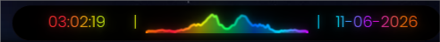</p>

### Inline workspace indicator

One side field (`Time` or `Date`) **crossfades into workspace dots** on demand - the active
workspace is a large accent dot, the rest dimmed. Show them on workspace switch, on hover, both,
or always; the dots can ride the rainbow gradient too. No separate widget, no layout shift.

<p align="center">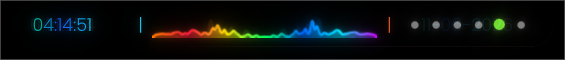</p>

## The hub

Hover the pill and it expands downward into a row of buttons; click one and the pill morphs further
into that panel - one cohesive surface, never loose floating widgets.

<p align="center">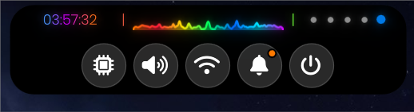</p>

- **Launcher** - the bar morphs into a fuzzy app launcher (fuzzy + frecency ranking, keyboard-first).
  Bind a key (e.g. `Super+Space`) to open it instantly via `ipc call hyprslob launcher`.
- **Menu** - a config-driven action palette of your own commands. Only appears once you've set
  `actions` in your config (see [Custom menus & dmenu](#custom-menus--dmenu)).
- **System** - OS + kernel, CPU/RAM/GPU usage & temps, focused window, system tray
  (left-click = activate, middle-click = hard-close the app, right-click = its menu).
- **Audio** - media controls (MPRIS), volume slider, mute, output switcher (PipeWire).
- **Network** - Wi-Fi & Bluetooth toggles + device list.
- **Notifications** - history, do-not-disturb, clear-all (HyprSlob is the notification daemon).
- **Power** - lock, sleep/hibernate, log out, restart, shut down (all configurable commands).
  Bind a key (e.g. `Super+Escape`) to the `power` IPC to open it as a quick power menu;
  `q`/`w`/`e`/`r`/`t` trigger the five actions.

<table align="center">
  <tr>
    <td align="center">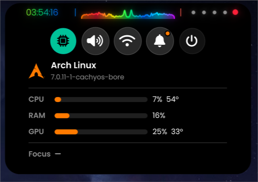<br><sub>System</sub></td>
    <td align="center">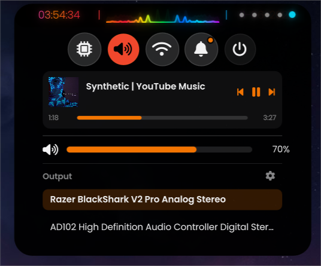<br><sub>Audio</sub></td>
    <td align="center">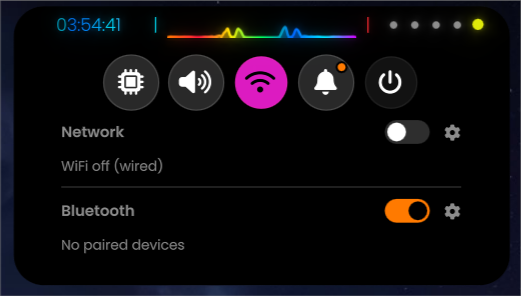<br><sub>Network</sub></td>
  </tr>
  <tr>
    <td align="center">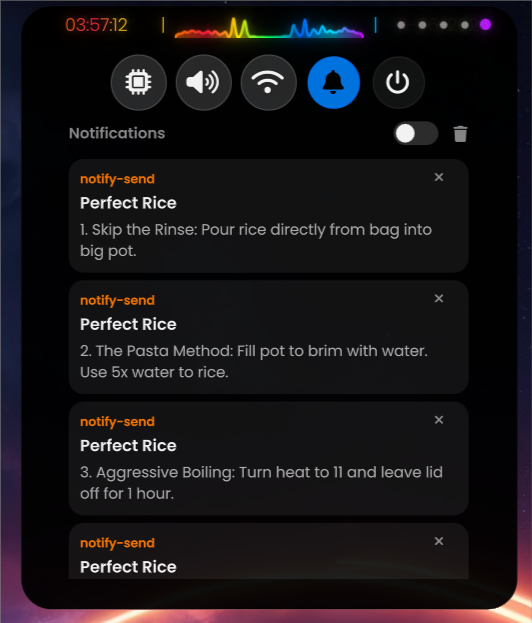<br><sub>Notifications</sub></td>
    <td align="center">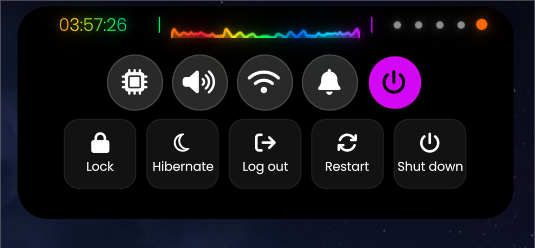<br><sub>Power</sub></td>
    <td></td>
  </tr>
</table>

## Custom menus & dmenu

HyprSlob ships a generic, themed picker you can drive two ways.

**The menu button** - add an `actions` list to your config; each entry appears in the bar's menu
button and runs its command via `sh -c`:

```jsonc
"actions": [
  { "label": "Power menu", "cmd": "wlogout" },
  { "label": "Clipboard",  "cmd": "cliphist list | qs-dmenu -p 'Clip:' | cliphist decode | wl-copy" }
]
```

The menu button only appears once `actions` is non-empty.

**`qs-dmenu`** is a drop-in `fuzzel --dmenu` replacement (`install.sh` puts it in `~/.local/bin`).
Pipe newline-separated choices in, get the selection on stdout - the picker renders right in the bar:

```sh
choice=$(printf '%s\n' Alpha Bravo Charlie | qs-dmenu --prompt 'Pick: ')
```

Items may carry an **image + colour preview** (tab-separated, shown in a side pane):

```
label <TAB> /path/to/preview.png <TAB> #rrggbb,#rrggbb,...
```

Under the hood it calls `qs -c hyprslob ipc call hyprslob menu <choicesFile> <resultFile> <prompt>`;
the wrapper just handles the temp-file plumbing and waits for the result.

## Make it yours

Appearance is **fully config-driven** - colors, rainbow gradient, corner radius, border, bloom,
font, opacity - live-reloaded from a single JSONC file. No theme system required. The same bar,
restyled:

<table align="center">
  <tr>
    <td align="center">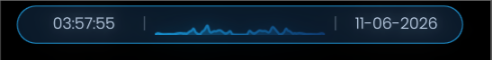<br><sub>Blue</sub></td>
    <td align="center">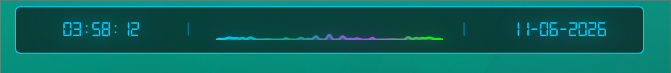<br><sub>Teal / rainbow</sub></td>
  </tr>
  <tr>
    <td align="center">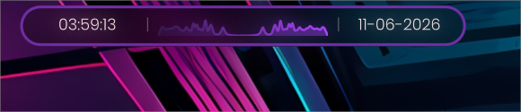<br><sub>Purple</sub></td>
    <td align="center">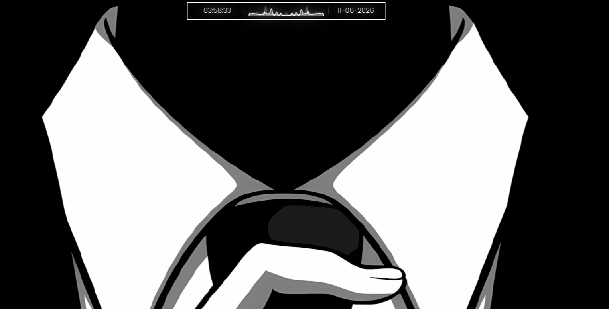<br><sub>Monochrome</sub></td>
  </tr>
</table>

Also: **zero-cost static mode** (turn off rainbow, bloom and the visualizer and there are no
animation repaint loops at all), per-monitor, auto-hides in fullscreen, and it reserves space like
a normal bar.

## Requirements

Arch (and derivatives):

```sh
# core
yay -S quickshell-git cava pavucontrol blueman \
       networkmanager nm-connection-editor pipewire python \
       ttf-nerd-fonts-symbols
# UI font used by default (or change "font.family" in the config)
yay -S ttf-poppins
```

Optional:
- `hyprlock` - the default lock command (override `commands.lock` to use something else).
- `nvidia-utils` - the GPU panel uses `nvidia-smi`; on AMD/Intel it just shows `-`.
- `brightnessctl` - enables the brightness slider (laptops with a backlight).
- `power-profiles-daemon` - enables the power-profile switcher (Saver / Balanced / Performance).

`hyprctl`, `systemctl`, `busctl`, `pactl` come with Hyprland / systemd / PipeWire.

## Install

```sh
git clone https://github.com/Waltherion/hyprslob.git
cd hyprslob
./install.sh
```

Then add the Hyprland integration and launch:

```sh
qs -n -c hyprslob
```

The `-n` (`--no-duplicate`) flag makes a second launch of the **same config** exit immediately,
so an autostart + a manual run (or a flaky theme-switch restart) can't leave you with two bars
stacked on top of each other. It's per-config, so it never touches your other Quickshell instances.
To force-clear a stuck instance, use Quickshell's own registry: `qs kill -c hyprslob`.

## Hyprland integration

HyprSlob targets Hyprland's **Lua config** (the classic `hyprlang` config is being retired).
Copy the autostart, layer-blur and keybind lines from **`hyprland/hyprslob.lua`** into your
`hyprland.lua`. They start `qs -c hyprslob`, blur the `quickshell-hyprslob` layer, add a toggle
keybind, and bind `Super+Ctrl+1..5` to open each panel directly.

## Configuration

All appearance lives in **`~/.config/hyprslob/config.jsonc`** and live-reloads on save.
The shipped **`config.default.jsonc`** is a fully-commented template - every option is listed
(commented out) with its default, so you can see exactly what's tweakable: colors, `stops`
(rainbow gradient), `cornerRadius`, `borderWidth`, `bloom`, `rainbow`, `font`, `commands`, and more.

## Notes

- Built for Hyprland's **Lua config** - the power buttons (logout) use Lua dispatch
  (`hl.dsp.exit()`), and the integration snippet is Lua. The classic `hyprlang` config is being
  retired and isn't a supported target.
- GPU stats auto-detect the vendor: **NVIDIA** (via `nvidia-smi`) reports power-based load -
  its `utilization.gpu` is a time-occupancy metric that over-reports light workloads, so power
  draw vs the card's limit tracks real work better; **AMD** (via the amdgpu sysfs
  `gpu_busy_percent`) reports real utilization. Intel iGPUs aren't covered yet (shown as `-`).

## Disclaimer

HyprSlob was built mostly with **Claude** (Anthropic's AI agent, via [Zed](https://zed.dev/)) by
someone with little coding experience - the "Slob" in the name is a deliberate, tongue-in-cheek nod
to that (a riff on "AI slop"); I'm not trying to hide it. It started purely as a personal project:
I like a minimal top bar, but I genuinely needed the modules a status bar gives you. Packed across
the top they made Waybar feel cluttered, and with two monitors at different resolutions a layout
that looked balanced on one screen came out cramped on the other. So the modules I actually use are
tucked into this bar's pop-down panels instead, keeping the top itself minimal. It's shared in case it's useful to someone else, but it is provided **as
is** - use it, and deal with any problems that come up, **at your own risk**.

Not affiliated with, or endorsed by, the **Hyprland** project. The "Hypr" in the name only reflects
that it's built with Hyprland users in mind.

## License

Copyright (C) 2026 Martin Walther.
Licensed under the **GNU General Public License v3.0 or later** (GPL-3.0-or-later) -
a strong copyleft license: any distributed copy or derivative must also be free software
under the same terms. See [LICENSE](LICENSE).
